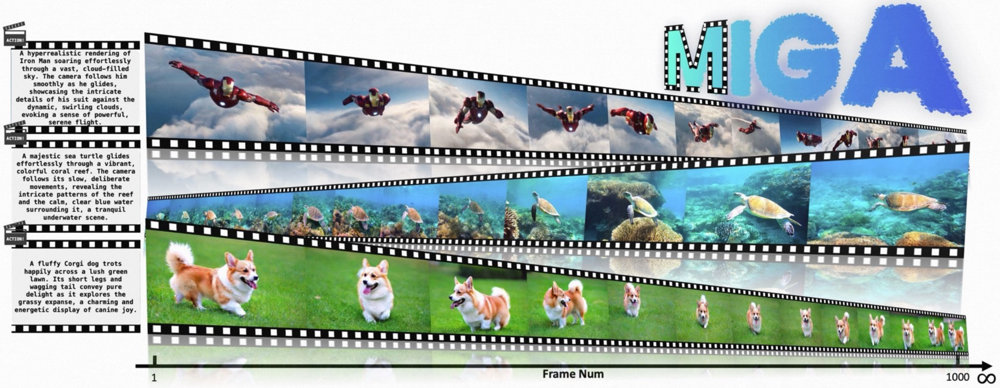

# MIGA: Enhancing Train-Free Infinite-Frame Generation for Consistent Long Videos

<div align="center">


[](https://arxiv.org/abs/2605.18233)
[](https://xiaokunfeng.github.io/miga_homepage/)

</div>

## Overview

<p align="center">
  
</p>

**MIGA** is a novel train-free method for infinite-frame video generation that addresses two key limitations of existing frame-level autoregressive frameworks (e.g., [FIFO-Diffusion](https://github.com/jjihwan/FIFO-Diffusion_public)):

1. **Two-Stage Training-Inference Alignment (TTA):** Reduces the noise span of latents fed to the model during inference through zigzag iterative denoising (Stage 1) and unified noise-level denoising (Stage 2), effectively bridging the training-inference gap.

2. **Dual Consistency Enhancement (DCE):** Promotes long-term temporal consistency through:
   - *Self-Reflection*: Evaluates and corrects early high-noise frames via latent-space similarity analysis
   - *Long-Range Frame Guidance*: Leverages distant low-noise frames to steer generation

MIGA achieves state-of-the-art performance on VBench and NarrLV benchmarks while maintaining constant memory consumption.


## Updates

* **[2025/05]** MIGA paper is accepted by ICML 2026~.


## Clone Repository

```bash
git clone https://github.com/AMAP-ML/MIGA.git
cd MIGA
```

MIGA is implemented on two foundation models: **Wan2.1** and **VideoCrafter2**. Instructions for each are provided below.

---

## &#x2600;&#xfe0f; Start with [Wan2.1](https://github.com/Wan-Video/Wan2.1)

### 1. Environment Setup

```bash
conda create -n miga_wan python=3.10 -y
conda activate miga_wan

pip install torch==2.4.0 torchvision==0.19.0 --index-url https://download.pytorch.org/whl/cu121
pip install diffusers==0.31.0 transformers accelerate
pip install easydict einops imageio imageio-ffmpeg
pip install opencv-python pillow tqdm thop pyyaml
```

### 2. Download Models from Hugging Face

| Model | Resolution | Checkpoint |
|:------|:-----------|:-----------|
| Wan2.1-1.3B | 480x832 | [Hugging Face](https://huggingface.co/Wan-AI/Wan2.1-T2V-1.3B) |

Store them as the following structure:
```
Wan2.1-T2V-1.3B/
  ├── Wan2.1_VAE.pth
  ├── models_t5_umt5-xxl-enc-bf16.pth
  └── ...
```

### 3. Run with Wan2.1

```bash
cd wan_based

python generate.py \
    --ckpt_dir /path/to/Wan2.1-T2V-1.3B \
    --miga_config ../configs/wan2.1_1.3B.yaml \
    --prompt "A fluffy Corgi dog trots happily across a lush green lawn. Its short legs and wagging tail convey pure delight as it explores the grassy expanse, a charming and energetic display of canine joy." \
    --save_dir ./outputs \
    --exp_name corgi_demo
```

---

## &#x2600;&#xfe0f; Start with [VideoCrafter2](https://github.com/AILab-CVC/VideoCrafter)

### 1. Environment Setup

```bash
conda create -n miga_vc2 python=3.10 -y
conda activate miga_vc2

pip install torch==2.1.0 torchvision==0.16.0 --index-url https://download.pytorch.org/whl/cu121
pip install pytorch-lightning==1.9.0
pip install omegaconf einops decord imageio imageio-ffmpeg
pip install opencv-python pillow tqdm open-clip-torch
pip install transformers kornia pyyaml
```

### 2. Download Models from Hugging Face

| Model | Resolution | Checkpoint |
|:------|:-----------|:-----------|
| VideoCrafter2 (Text2Video) | 320x512 | [Hugging Face](https://huggingface.co/VideoCrafter/VideoCrafter2/blob/main/model.ckpt) |

Store them as the following structure:
```
videocrafter_models/
  └── base_512_v2/
      └── model.ckpt
```

### 3. Run with VideoCrafter2

```bash
cd videocraft_based

python generate.py \
    --ckpt_path /path/to/videocrafter_models/base_512_v2/model.ckpt \
    --miga_config ../configs/videocrafter2.yaml \
    --prompt "An astronaut floating in space, high quality, 4K resolution." \
    --save_dir ./outputs \
    --exp_name astronaut_demo
```

---

## Configuration

MIGA hyperparameters are managed via YAML config files in `configs/`. You can modify these files or override individual parameters via CLI arguments.

| Parameter | Wan2.1 | VC2 | Description |
|:----------|:------:|:---:|:------------|
| `sampling_steps` | 54 | 64 | Total denoising steps *T* |
| `saw_width` | 7 | 4 | Zigzag width *L_zig* in Stage 1 |
| `long_iter_nums` | 20 | 30 | Number of generated latent chunks |
| `temporal_memory_len` | 4 | 4 | Long-range guidance frames *m_guid* |
| `involve_resample` | true | false | Enable self-reflection (DCE) |
| `resample_threshold` | 0.001 | 0.05 | Consistency drop threshold *delta_adju* |

**Generated video length:** `N = long_iter_nums x saw_width` latent frames

**Override example:**
```bash
python generate.py \
    --ckpt_dir /path/to/model \
    --miga_config ../configs/wan2.1_1.3B.yaml \
    --prompt "Your prompt here" \
    --long_iter_nums 40 \
    --involve_resample true
```

---

## Citation

If you find this work useful, please cite our paper:

```bibtex
@inproceedings{feng2025miga,
    title={Enhancing Train-Free Infinite-Frame Generation for Consistent Long Videos},
    author={Xiaokun Feng and Mingze Wu and Hao Yu and Jitan Tan and Jie Xiao and Fangyuan Zhao and Jiaxu Miao and Kaiwen Hu and Jie Wu and Xiangyang Chu and Ke Huang},
    booktitle={ICML},
    year={2025}
}
```


## Acknowledgements

Our codebase builds on [VideoCrafter2](https://github.com/AILab-CVC/VideoCrafter), [Wan2.1](https://github.com/Wan-Video/Wan2.1), and [FIFO-Diffusion](https://github.com/jjihwan/FIFO-Diffusion_public).
We appreciate their excellent work!
